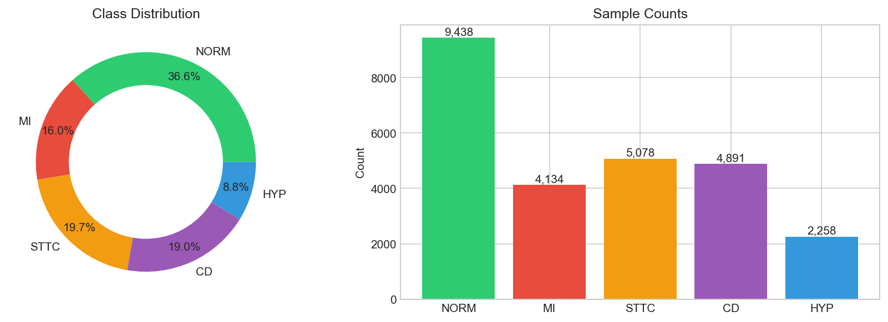
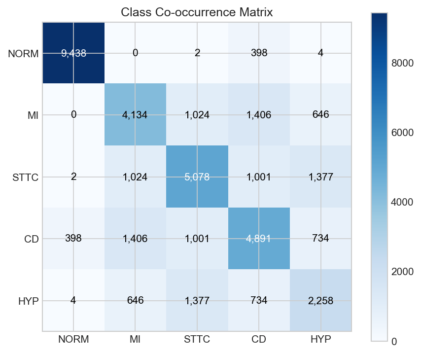
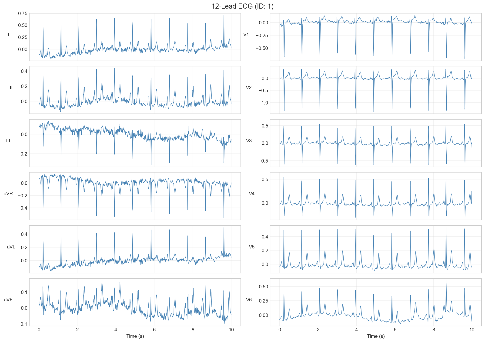
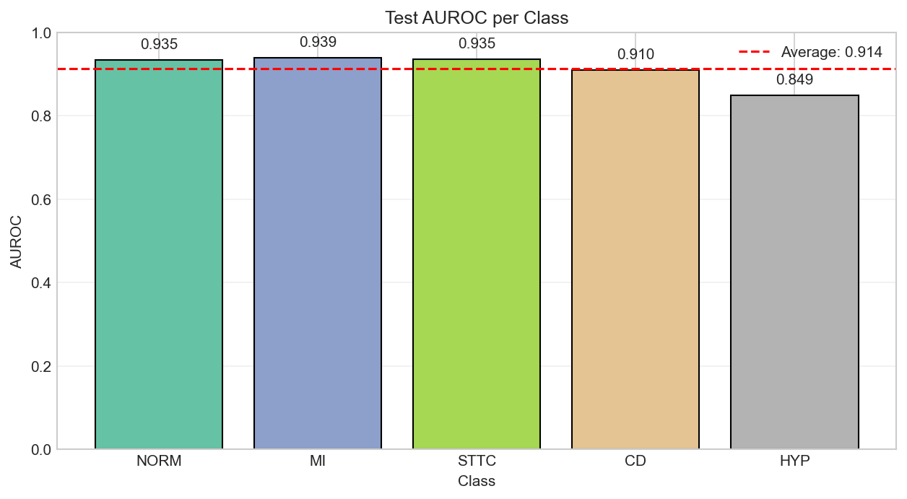
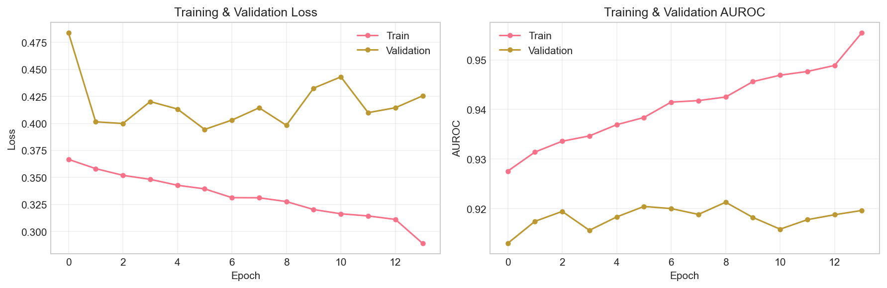
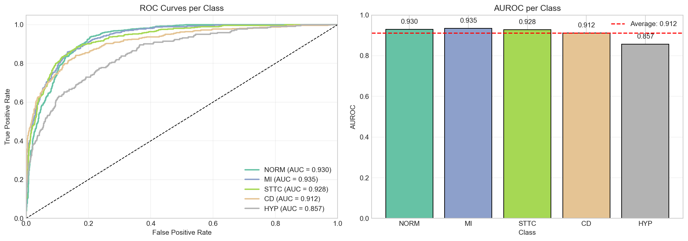
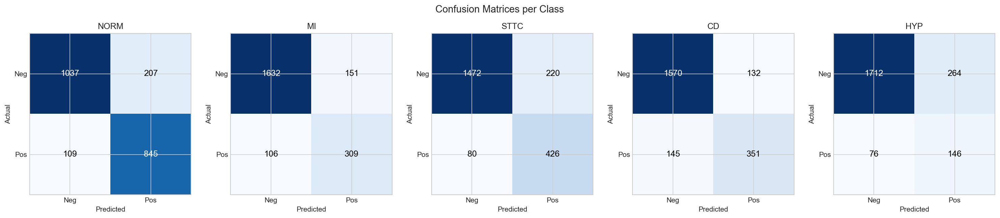
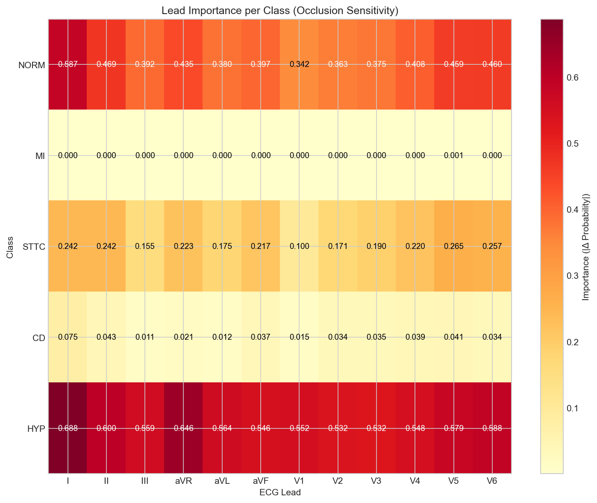

# TrustECG

**Explainable AI for 12-lead ECG Classification**

<div align="center">

[](https://www.python.org/downloads/)
[](https://pytorch.org/)
[](https://lightning.ai/)
[](https://streamlit.io/)

[Features](#key-features) • [Demo](#demo) • [Results](#results) • [Installation](#installation) • [Usage](#usage) • [Documentation](#documentation)

</div>

---

## Overview

TrustECG is an explainable deep learning system that automatically classifies 12-lead ECG recordings into 5 cardiac conditions. Unlike traditional black-box models, TrustECG shows doctors exactly why it made each prediction through attention visualization.

Built on the [PTB-XL dataset](https://physionet.org/content/ptb-xl/) containing 21,801 clinical ECGs verified by cardiologists.

**Why TrustECG?**

- Doctors need to understand AI decisions, not just trust them blindly
- Patients often have multiple cardiac conditions simultaneously
- Real-time predictions with comprehensive visual explanations
- Professional dashboard ready for clinical demonstration

---

## Key Features

| Feature                            | Description                                                  |
| ---------------------------------- | ------------------------------------------------------------ |
| **Multi-Label Classification**     | Detect 5 cardiac conditions simultaneously from a single ECG |
| **Attention-Based Explainability** | See which ECG segments and leads drove the prediction        |
| **Professional Dashboard**         | Interactive Streamlit app with dark cardiac theme            |
| **High Performance**               | 92.1% Validation AUROC, 91.2% Test AUROC                     |
| **Fast Inference**                 | Real-time predictions (~10ms per ECG)                        |

---

## Diagnostic Classes

| Class    | Condition              | Description                           | Prevalence |
| -------- | ---------------------- | ------------------------------------- | ---------- |
| **NORM** | Normal                 | No significant cardiac abnormalities  | 43.3%      |
| **MI**   | Myocardial Infarction  | Heart attack or ischemic damage       | 19.0%      |
| **STTC** | ST/T Change            | Abnormalities in ST segment or T wave | 23.3%      |
| **CD**   | Conduction Disturbance | Abnormal electrical conduction        | 22.5%      |
| **HYP**  | Hypertrophy            | Enlarged heart chambers               | 10.4%      |

### Class Distribution

<p align="center">
  
</p>

### Label Co-occurrence

Patients often have multiple conditions. This heatmap shows how frequently conditions occur together:

<p align="center">
  
</p>

---

## Architecture

TrustECG uses a custom neural network called **ExplainableECGNet** with 276,421 parameters:

<p align="center">
  
</p>

**Pipeline:**

1. **Input**: 12-lead ECG (12 × 1000 samples at 100 Hz)
2. **Preprocessing**: Bandpass filter (0.5-40 Hz) + Z-score normalization
3. **Encoder**: Lead-wise ResBlocks [32 → 64 → 128 channels]
4. **Temporal Attention**: Learn important time points
5. **Lead Attention**: Learn important leads
6. **Output**: 5-class probabilities via sigmoid

### Sample 12-Lead ECG

<p align="center">
  
</p>

---

## Results

### Overall Performance

| Metric               | Validation | Test  |
| -------------------- | ---------- | ----- |
| **AUROC (Macro)**    | 92.1%      | 91.2% |
| **F1-Score (Macro)** | 69.4%      | 69.4% |

### Per-Class AUROC

<p align="center">
  
</p>

| NORM  | MI    | STTC  | CD    | HYP   |
| ----- | ----- | ----- | ----- | ----- |
| 93.5% | 93.9% | 93.5% | 91.0% | 84.9% |

### Training Curves

<p align="center">
  
</p>

### ROC Curves

<p align="center">
  
</p>

### Confusion Matrices

<p align="center">
  
</p>

---

## Explainability

What makes TrustECG different from a black box: we can visualize exactly what the model focuses on.

### Lead Importance

The radar chart shows which ECG leads contributed most to each prediction:

<p align="center">
  
</p>

### Explainability Methods

| Method                    | What It Shows                                             |
| ------------------------- | --------------------------------------------------------- |
| **Temporal Attention**    | Which time points are important (QRS, ST segment, T wave) |
| **Lead Attention**        | Which of the 12 leads contributed most                    |
| **Occlusion Sensitivity** | How prediction changes when each lead is masked           |
| **Attention Heatmap**     | Combined view across all leads and time                   |

---

## Demo

### Streamlit Dashboard

The dashboard has three pages:

| Page               | Description                                       |
| ------------------ | ------------------------------------------------- |
| **Dashboard**      | Project overview, metrics, feature highlights     |
| **Analyze ECG**    | Load ECGs by ID, view predictions with confidence |
| **Explainability** | Attention maps, lead radar, occlusion analysis    |

---

## Installation

### Prerequisites

- Python 3.10+
- CUDA 11.8+ (optional, for GPU)

### Quick Install

```bash
# Clone repository
git clone https://github.com/yourusername/TrustECG.git
cd TrustECG

# Create virtual environment
python -m venv .venv
.venv\Scripts\activate  # Windows
# source .venv/bin/activate  # Linux/Mac

# Install dependencies
pip install -e .
```

---

## Usage

### Run the Dashboard

```bash
streamlit run src/app/streamlit_app.py
```

Opens at `http://localhost:8501`

### Quick Start

1. Click **"Load Model"** in the sidebar
2. Enter an ECG ID (1-21800)
3. Click **"Load ECG"** to see predictions
4. Go to **Explainability** page for visualizations

**Example ECG IDs:**

- `9` - Normal ECG
- `42` - Various conditions
- `100` - Multi-label example

### Programmatic Usage

```python
import torch
from src.app.streamlit_app import ExplainableECGNet, ECGPreprocessor
import wfdb

# Load model
model = ExplainableECGNet()
state_dict = torch.load("checkpoints/trustecg_model.pt", map_location="cpu")
model.load_state_dict(state_dict)
model.eval()

# Load ECG
record = wfdb.rdrecord("dataset/records100/00000/00009_lr")
signal = record.p_signal.T  # (12, 1000)

# Preprocess and predict
preprocessor = ECGPreprocessor()
x = torch.from_numpy(preprocessor(signal)[None, ...])

with torch.no_grad():
    output = model(x, return_attention=True)
    probs = output["probs"].numpy().squeeze()

# Print results
classes = ["NORM", "MI", "STTC", "CD", "HYP"]
for cls, prob in zip(classes, probs):
    print(f"{cls}: {prob:.1%}")
```

---

## Project Structure

```
TrustECG/
├── src/
│   └── app/
│       └── streamlit_app.py      # Dashboard + model + preprocessing (all-in-one)
├── notebooks/
│   └── TrustECG_Notebook.ipynb   # Full training & evaluation pipeline
├── checkpoints/
│   ├── trustecg_model.pt         # Trained model weights (best val AUROC)
│   └── model_config.json         # Model hyperparameters
├── dataset/                       # PTB-XL dataset (21,801 ECGs)
│   ├── ptbxl_database.csv        # Patient metadata & labels
│   ├── scp_statements.csv        # SCP diagnostic code definitions
│   └── records100/               # 100 Hz ECG recordings
├── figures/                       # Generated visualizations
├── reports/
│   ├── TrustECG Report.pdf       # Detailed project report
│   └── TrustECG Report.docx
├── docs/                          # Project documentation
│   ├── index.md                  # Documentation home
│   ├── getting-started.md        # Installation & first steps
│   ├── data-pipeline.md          # Dataset, preprocessing, splits
│   ├── architecture.md           # Model architecture deep-dive
│   ├── training.md               # Training, loss, evaluation
│   ├── explainability.md         # Attention & occlusion analysis
│   ├── dashboard.md              # Streamlit app guide
│   └── api-reference.md          # Class & function reference
├── .streamlit/
│   └── config.toml               # Dashboard theme configuration
└── pyproject.toml                 # Dependencies & project metadata
```

---

## Documentation

| Document | Description |
|----------|-------------|
| [Documentation Home](docs/index.md) | Table of contents and project overview |
| [Getting Started](docs/getting-started.md) | Installation, setup, and first prediction |
| [Data Pipeline](docs/data-pipeline.md) | PTB-XL dataset, preprocessing, train/val/test splits |
| [Model Architecture](docs/architecture.md) | ExplainableECGNet design, tensor shapes, and design decisions |
| [Training Guide](docs/training.md) | Loss function, class weighting, evaluation metrics |
| [Explainability](docs/explainability.md) | Attention visualization, occlusion analysis, clinical validation |
| [Dashboard Guide](docs/dashboard.md) | Streamlit app pages, customization, deployment |
| [API Reference](docs/api-reference.md) | Complete class and function documentation |
| [Project Report](reports/TrustECG%20Report.pdf) | Full methodology, results, and findings |
| [Training Notebook](notebooks/TrustECG_Notebook.ipynb) | End-to-end training and evaluation pipeline |

---

## Technical Specifications

| Component      | Specification                 |
| -------------- | ----------------------------- |
| Model          | ExplainableECGNet             |
| Parameters     | 276,421                       |
| Input Shape    | 12 × 1000 samples             |
| Output         | 5 class probabilities         |
| Framework      | PyTorch 2.6.0 + Lightning 2.5 |
| Training Time  | ~10 minutes on RTX 2050       |
| Inference Time | ~10ms per ECG                 |

---

## References

1. Wagner, P., et al. "PTB-XL, a large publicly available electrocardiography dataset." _Scientific Data_ 7.1 (2020): 1-15.
2. Vaswani, A., et al. "Attention is all you need." _NeurIPS_ 2017.
3. He, K., et al. "Deep residual learning for image recognition." _CVPR_ 2016.

---

<div align="center">

**TrustECG** - Because healthcare AI should show its work.

</div>
